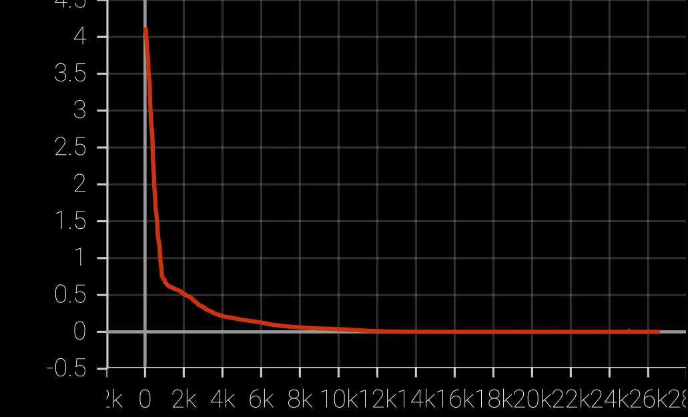
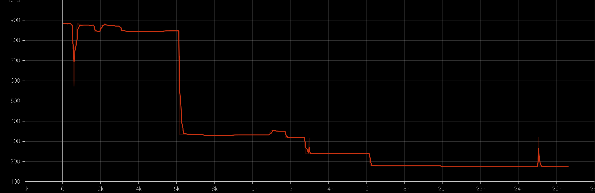

Le probleme que je tente de resoudre ici est la diversité des séries temporelles.
Si on veut modéliser un bearing, on peut mettre un capteur de pression, ou deux, ou
un capteur de vibration, de température, on peut échantillonner toutes les secondes,
millisecondes ou minutes. Des séries temporelles très variées représenteront le même
objet, ou des objets semblables. On veut pouvoir intégrer toutes ces mesures dans un seul modèle.

Je propose pour cela de projeter les séries vers un unique espace temporel composé de 100 trames.
Je teste d'abord la dataset de bearings IMS, car je pourrai ensuite tester d'autres datasets.
La dataset est composée de courtes séquences de 1s séparées d'environ 10 minutes.

### Model

- Chaque séquence de 1s passe d'abord dans un ConvNet à 3 étages, suivi par un DAN, qui donne
  un unique vecteur $x(t)$.
- Sur le Test 2, utilisé comme training dans certains papiers, on obtient ainsi une série d'environ
  1000 trames: $X=(x(1),\dots,x(T))$.
- Je projette ensuite $X$ vers ma série commune de 100 trames $C=(c(1),\dots,c(100))$ en
  représentant chaque $c(t)\in R^{10}$ par un vecteur de paramètres de dimension 10.
- Chaque $x(t)$ est transformé en un vecteur de dimension 10
  $$z(t)=f_{MLP}(x(t))$$
  par un MLP, puis je calcule l'alignement optimal entre $z(1),\dots,z(T)$ et $C$ avec Viterbi
  au moyen de la similarité dot-product $d(t,\tau)=z(t) \cdot c(\tau)$.
  Toutes les transitions ont la même probabilité, mais j'impose un ordre temporel sur $Z$
  avec $(x(1),z(1))$ alignés et $(x(T),z(100)$ alignés.
  Soit $a(\cdot)$ l'alignement obtenu: $x(t)$ est aligné avec $z(a(t))$.
- Je réduis ensuite $X$ en une séquence de 100 trames en moyennant les $x(t)$ selon $a(\cdot)$:
  $$\zeta(\tau) = \frac 1 {|\{t:a(t)=\tau\}|} \sum_{t:a(t)=\tau} x(t)$$
  $\forall~~ 1\leq \tau \leq 100$
- J'applique ensuite un LSTM sur les 100 trames:
  $$h(\tau) = f_{LSTM}(\zeta(1),\dots,\zeta(\tau))$$
- Puis un MLP de prédiction du RUL:
  $$\hat y(\tau) = f_{MLPrul}(h(\tau))$$
- Il y a 2 objectifs à apprendre avec ce modèle: aligner, et prédire le RUL
- Pendant l'apprentissage de l'alignement, je teste 2 loss possibles:
  une loss qui favorise un alignement équilibré (cf. Training stage 1), et une CTC loss.
- Pendant l'apprentissage de la prédiction du RUL, j'utilise une loss MSE et la valeur gold du RUL est
  $$y(\tau)=T-\max(t:a(t)=\tau)$$

### Training stage 1

mar. 15 mars 2022 09:06:10 CET

Je train avec un seul objectif: obtenir un alignement equi-reparti.
Pour cela, je commence par diviser la TS en 100 segments egaux:
$$\bar a(t) = 1+int(100*(t-1)/T)$$
et je minimise la loss:
$$l_{equi} = - \sum_{1\leq t\leq T} d(t,\bar a(t))$$

Il m'a fallu tuner le LR pour que ca converge, et j'obtiens la loss suivant:

et j'affiche aussi le nombre maximum de trames projetees sur un segment avec Viterbi
$$\max_{\tau} \left( |\{ t:a(t)=\tau \}| \right)$$

On obtient bien une projection assez bien equilibree.
Je peux passer au stage 2 = train le RUL pour voir si cette projection degenere, auquel cas
il faudra alterner RUL et MSE.

